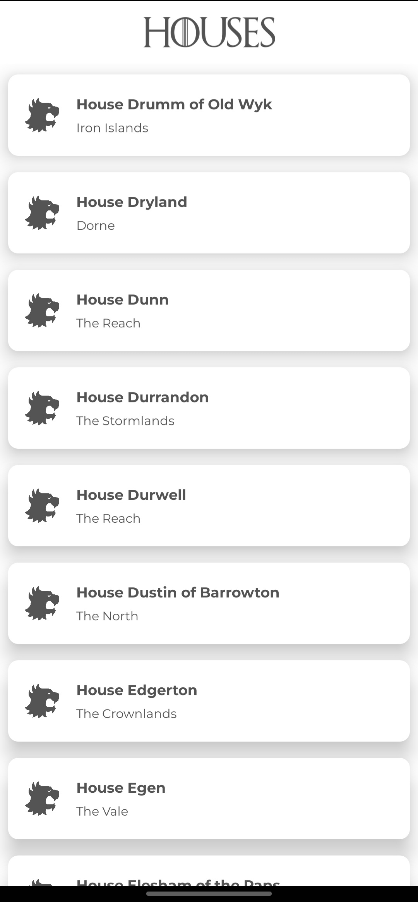
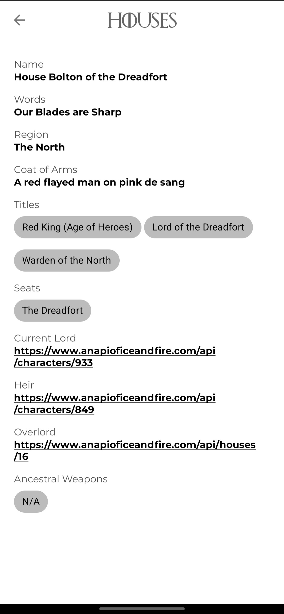
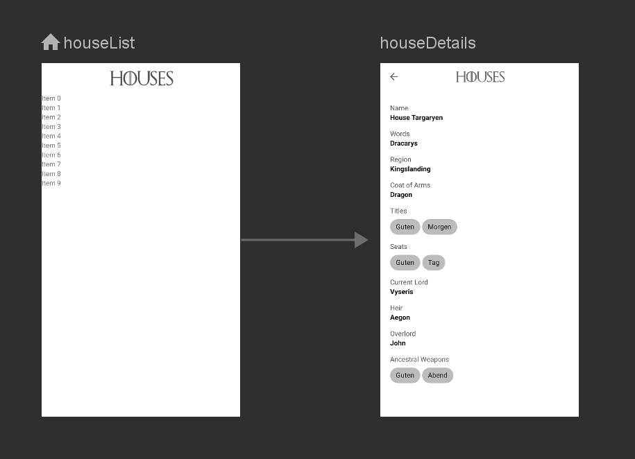

## Table of contents 📋
- [Required tools 🔨](#required-tools-)
- [Project overview](#project-overview)
- [Architecture 🏠](#architecture-)
  - [MVVM](#mvvm)
  - [Networking 🌐](#networking-)
  - [UI 📺](#ui-)
  - [Dependency Injection with Hilt 💉](#dependency-injection-with-hilt-)
  - [Multi-Threading with Coroutines 🏿](#multi-threading-with-coroutines-)
- [Running the app ▶](#running-the-app-)

<p float="left" align="center">
    
    
    
</p>

## Required tools 🔨
- Kotlin 1.7.10
- Java 11
- Gradle 7.5.1
- Android Studio Chipmunk 2021.2.1 Patch 2 or higher

## Project overview

* `Android API` version minimum is `API level 21`

* The architecture used is `MVVM (Model-View-ViewModel)` to facilitate separation of concerns (UI from business logic)

* Multi-Threading is handled using `Coroutines`

* Dependency Injection is provided by `Hilt`.

* `Retrofit` is used as the networking library. Under the hood lies Okhttp.

* `Jetpack Navigation Component` is used to ease the process of navigation.

* Single Activity Architecture is applied to modularize the app

## Architecture 🏠

### MVVM

`MVVM (Model-View-ViewModel)` is an architecture pattern that aims at loosely coupling concerns.

- Model includes repositories and data sources (API Endpoints, LocalData DAOs)
- View includes the XML or Compose composable functions. Anything that deals with showing actual view components.
- ViewModel acts as the mediator between the Model and the View.

This is a good approach because it means each layer can be swapped out at any time without the need to change other parts of the app.

For example, when a user presses the login button, the UI (after validating the TextFields) dispatches that information to the ViewModel, which in turn makes a request to the Model layer, which then sends a request to the API and returns a response that goes through the same process in reverse.

### Networking 🌐

`Retrofit` is used to make network requests. Under the hood lies OkHttp. This is a very reliable networking client with many features.

There is a custom adapter for wrapping networking requests and returning a sealed class with different states. Example: `[Loading, Success, ApiError]`...

This helps avoid repetition of code when writing network requests and also facilitates logging requests in one place.

All you have to do is define your request in `APIService` and then call the method you defined and you'll receive a nice `RequestStatus` sealed class with request status.

RequestStatus is the backbone of this implementation. It's a generic sealed class that takes a response object and error object as well.

Example: `RequestStatus<List<House>, String>`

`List<House>` is the success response, while `String` is the error response. \
Note that it can be any class/object such as String or any other custom defined class... Moshi will handle parsing :)

No need to check if internet is available or any other hacks, it's all handled for you and returned in the aforementioned sealed class. You just need to use a switch case to handle the returned cases.

Moshi is used for parsing JSON into POJOs (or rather data classes since this is Kotlin 😀 )  and viceversa.\
This a straightforward parser, all you have to do is annotate your field with `@Json(name = "field_name")` and most importantly, annotate your class with `@JsonClass(generateAdapter = true)` so that Moshi can generate type adapters.\
This ensures type safety and avoids "magic" that often happens at runtime when for instance, a non-null field is null from the API, leading to crashes. This avoids it since it rejects that response as erroneous because it violates the contract with the API.\
Essentially, validation is naturally and automatically done by Kotlin and Moshi. For example, if you declare a field as not-null AKA required then you will be sure that in the event the API returns null for that field, validation will fail and `ParseError` will be returned in `RequestStatus`. Neat, eh?

Here's a look at a typical data class:
```
@JsonClass(generateAdapter = true)
data class House(@Json(name = "name") val token: String,
                 @Json(name = "words") val words: String?,
                 @Json(name = "title") val title: List<String>?,
                 @Json(name = "ancestralWeapons") val ancestralWeapons: List<String>)
```
> NOTE: `@JsonClass(generateAdapter = true)` is very important. Forget to add it and you'll be playing Russian roulette with NPEs

Notice the `?` after the variable type `String?`, it means **nullable**, and in our case it means a field is optional.\
Whereas those fields that don't have it are required since they must be present in the response.

Regarding actual usage of `RequestStatus`, typical network request response handling looks like this:

```
viewModel.getResponse.observe(viewLifecycleOwner) { response ->
            when(response){
                is RequestStatus.Loading -> {
                    //handle loading state, show a progress bar perhaps...
                }
                is RequestStatus.Success -> {
                    response.data contains the object with response data class
                }
                is RequestStatus.ApiError -> {
                    //API is having none of that for some reason or endpoint doesn't exist or something went wrong. 
                    //handling this depends on the usercase
                }
                else -> {
                    //Server error, network error..., check the RequestStatus class for all cases and handle them accordingly
                    binding.root.handleErrorResponses(response)
                }
            }
        }
```

Notice the `viewLifecycleOwner` for binding this to the view so that if the view is destroyed, the method also goes with it, to avoid awkward cases where the background request returns to a view that has been destroyed.

Imagine a scenario where you open a screen that makes a request but then you close the screen before getting a response, but when the response does come, it will find a null view, leading to nasty `NullPointerExceptions`

The networking layer is well implemented and adding new requests should be a breeze.

## UI 📺



This is a single-activity architecture. There's only one activity and the rest are fragments. This has multiple advantages.
- App wide configuration is done once: fonts, dark mode, configuration...
- Modular UI. You can change one part of the app without affecting the other.
- Flexibility regarding how the UI is developed.
- Easier navigation
- Use less resources as Fragments are lighter since they're detached when out of view.

The view used is standard XML view based system. However, one thing to note is that instead of `findViewById`, `ViewBinding` is used because of type safety advantage it provides.\
For more information, here's a great guide: [ViewBinding guide](https://developer.android.com/topic/libraries/view-binding)

> `findViewById` is still used in a few places where `ViewBinding` cannot work.\
> Example: Recyclerview adapters

## Dependency Injection with Hilt 💉

Hilt is a simplification of Dagger2, for the better, which was a powerful DI framework for Android but the learning curve and complexity were so steep that Google decided to make it simpler by developing Hilt.\

Hilt is really made for Android since it provides convenient annotations such as `HiltViewModel` which immediately allow you to inject dependencies into the ViewModel without hassle as opposed to working with unpleasant ViewModel Factories.

Let's take a look at the below example. Let's say we wish to create a Singleton instance of NetworkUtils.

```
@Module
@InstallIn(SingletonComponent::class)
object NetworkUtilsModule {

    @Singleton
    @Provides
    fun provideNetworkUtils(@ApplicationContext context: Context): NetworkUtils {
        return NetworkUtils(context)
    }

}
```

- Module: tells Hilt that this is a module
- InstallIn: the scope of the object. It tells Hilt where to instantiate this object. In this case it's the Application class, which will live for the entire during of the app.
- Provides: means this is a dependency
- Singleton: This means this is a Singleton class and only one instance will be created.

The benefits of Hilt are apparent in the above code block. `@ApplicationContext` represents `applicationContext` and is provided for us without need to pass it around. You can use it to instantiate your objects that need it easily.

Also, notice that the function `provideNetworkUtils` returns `NetworkUtils`. Hilt is intelligent enough to inject this instance wherever we call `NetworkUtils`. Cool, eh?

To use that instance, you can:
```
@Inject lateinit var networkUtils: NetworkUtils
```

As simple as that. You can then use that instance anywhere.
And if you were to change the implementation or constructor parameters of this class, you wouldn't have to edit everyplace you instantiated this class, you'll only have to do it in one single place. That's also one of the benefits.
Testing is another advantage since you can simply mock the instance.

> injected instances cannot be private since Hilt wouldn't be able to access them.

And then to make a Fragment or Activity injectable, you use `AndroidEntrypoint` annotation.
```
@AndroidEntryPoint
class MyFragment : Fragment() {
  @Inject lateinit var networkUtils: NetworkUtils
  ...
}
```

For other classes
```
class MyClass @Inject constructor(val networkUtils: NetworkUtils)
```

> After you've defined your modules, you need to build your project so Hilt can generate the classes and functions for you to use.

For more information, here are great guides for Hilt:
- [Hilt guide 1](https://developer.android.com/training/dependency-injection/hilt-android)
- [Hilt guide 2](https://dagger.dev/hilt/)

## Multi-threading with Coroutines 🏿

Coroutines are Kotlin's way of managing background threads. They simplify the process so much. You don't need to use callbacks or any other hacky approaches.

Essentially, a coroutine is a lightweight thread that suspends without blocking the current main thread, does an operation and then resumes.

Let's say you're in a ViewModel and wish to make a request to fetch some data:

```
viewModelScope.launch(Dispatchers.IO) {
    ... long running operation
}
```

As simple as that.

> `viewModelScope` is a convenience field given to use by AndroidX Lifecycle components for binding the request to the lifecycle of the ViewModel. That means if the ViewModel is destroyed, the request also stops. This avoids awkward states where a request is running with no corresponding view or ViewModel.

`Dispatchers.IO` means the thread will be doing IO operations

You must also remember to switch the context from background to main thread when working with teh UI. Remember, only the thread that has created the view can modify it, so if you attempt to update textfield value for example on a background thread, Android will throw an exception at you.

To switch thread to main thread (only necessary when in Fragment or Activity):

```
CoroutineScope.launch(Dispatchers.IO) {
    ... long running operation
    
    withContext(Dispatchers.Main){
      //update UI
    }
}
```

If you're going to be doing calculations, you can also use `Dispatchers.Default` to optimize for calculations. `Dispatchers.IO` is optimized for network requests, DB reads or file access.

For more information, here's a comprehensive [guide to Coroutines](https://developer.android.com/kotlin/coroutines)

## Running the app ▶

Running the app is simple.

- Connect your device to your computer or emulator ([guide to create emulator](https://developer.android.com/studio/run/managing-avds))
- In Android Studio, press run ▶️or Shift+F10

If it's your first time running the app, make sure Gradle has synced all the dependencies and everything is up to date before running as it will save you time.

## Troubleshooting 😵‍💫

There's a saying that goes like this: whatever that can go wrong, will go wrong. Problems can arise when building an Android project but there's no need to panic. Down below are some of the most common issues and how to fix them.

- Build is seemingly taking forever. ADB Daemon could be stuck.

  > `gradle --stop` (stop the gradle daemon - very useful)

  > `rm -rf ./gradle/caches/` (remove the cache) on Linux or `rmdir ./gradle/caches/` on Windows

  > Run again

- Sometimes you get an error saying the device isn't connected while it is. run the code below to stop and start ADB

  > `adb kill-server`

  > `adb start-server`

- Android Studio is behaving weirdly. Ex: code completion not working, every single line is red?
  > Click on `File > Invalidate Caches > Invalidate and Restart`
